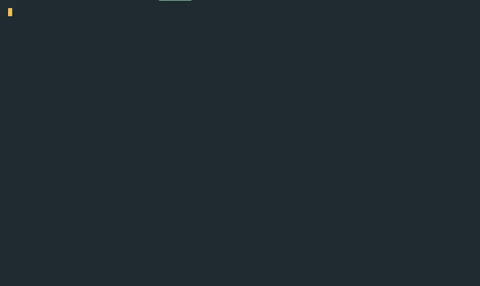

# Dimensions

This is an **open sourced** **generic** **Artificial Intelligence competition framework**, intended to provide you all the infrastructure needed to run your own AI competition with no hassle.

All you need to do?

Code a competition design and code a bot

Dimensions handles the rest, including match running, tournament running, TrueSkill rankings, and a local API and website through which you can watch this all happen at once. Dimensions allows you to design virtually any kind of AI competition you want with its vast array of configuration options and choices.

Moreover, Dimensions utilizes an I/O based model to run competitions and pit AI agents against each other, allowing it to be generic and language agnostic so anyone from any background can compete in your competition design.

This was inspired by [Battlecode](battlecode.org/) and [Halite](https://halite.io/)

Keep reading to learn how to [get started](#getting-started) and make a tournament like this:



Of which the [AI bots](https://github.com/StoneT2000/Dimensions/blob/master/tests/js-kit/rps/rock.js) are all coded in about 10 lines or less (ignoring the starter kit)

```js
const kit = require('./kit');
const agent = new kit.Agent();
agent.initialize().then(async () => {
  while(true) {
    console.log('R'); // tell the match you want to play Rock in the game
    agent.endTurn(); // end turn
    await agent.update(); // wait for updates
  }
});
```

As another proof of concept of how seamless and generalizable this framework is, see [the recreation of Halite 3](https://github.com/StoneT2000/dimensions-halite3) using this framework.

Follow these links to jump straight to [Documentation](https://stonet2000.github.io/Dimensions/index.html),  [Contributing](#contributing), [Development](#development) or [Plans](#plans) curated by the owner and the community.

Also checkout the blog post introducing the motivation for Dimensions and thoughts about it here: https://stonet2000.github.io/blog/posts/Dimensions/index.html

## Features

- Easy to build an AI competition that is language agnostic, allowing any kind of bot in any language to compete in your competition
- Can run many kinds of AI competitions and run different kinds of competition formats like round robin or using Trueskill in a ladder tournament.
- Comes with an API served locally that gives access to data on ongoing matches and tournaments and allows for direct control of matches and tournaments through the API. See this page for details on this API: https://github.com/StoneT2000/Dimensions/wiki/Dimensions-Station-API
  - Check out https://github.com/StoneT2000/Dimensions-web if you want a website to view the API from.

## Getting Started

At the moment, Dimensions supports competition designing through JavaScript / TypeScript only. However, all AI agents can be coded in any language due to the I/O model.

First, install the `dimensions-ai` package

```
npm install dimensions-ai
```

Create a new file called `run.js` and inside it we need to first `require` the package

```js
const Dimension = require('dimensions-ai');
```

In order to start writing AI to compete against each other in a competition, you need to do two things.

1. Design the competition
2. Design an AI starter kit

You need to design a competition to allow people to compete and facilitate the matches. More info on that soon. And it is highly suggested to design an AI starter kit so people can get straight into competing.

Let's first design a simple RockPaperScissors competition. To design a competition, you will need to code. On the roadmap there are plans to potentially make a no-code competition designer.

### Designing The Competition

To design the competition we need to create a `class` that extends `Dimension.Design`. Let's call this design `RockPaperScissorsDesign`. All `design` classes requires the implementation of 3 `async` lifecycle functions that facilitate a match, namely

| Design Lifecycle Functions | Purpose                                        |
| -------------------------- | ---------------------------------------------- |
| `initialize`               | Perform match initializations                  |
| `update`                   | Update the match state and return match status |
| `getResults`               | Return the match results                       |

More details found on the documentation [here](https://stonet2000.github.io/Dimensions/classes/_design_index_.design.html)

So now we would have something like

```js
import * as Dimension from 'dimensions-ai';
// or const Dimension = require('dimensions-ai');
class RockPaperScissorsDesign extend Dimension.Design {
  async initialize(match) {
    ...
  }
  async update(match, commands) {
    ...
  }
  async getResults(match) {
    ...
  }
}
```

Each `match` parameter passed in is of type `Match` and is the same `match` that each lifecycle function works with. A `match` exposes key properties and functions for use to design the competition. The most important properties are `match.agents, match.state, match.configs` and important functions are `match.send, match.sendAll`. All documented [here](https://stonet2000.github.io/Dimensions/classes/_match_index_.match.html)

`match.agents` contains all the participating players, named as `agents`, all of type `Agent`. Each agent has fields such as `agent.id` and `agent.name`, useful for designing a competition when trying to decide what to communicate with agents in a competition. In rock paper scissors, usually theres only 2 agents. Note that agents are numbered from 0, 1, 2... and so forth.

`match.state` is a property that accessible through the `match` input parameter of all 3 lifecycle functions, and can be used to store any information that should be retained or use throughout the match. This could be results of past rounds in a best of 3 rock paper scissors game.

`match.configs` is the same argument you pass in when running a `Match`, `Tournament` etc. You can send in same configurations such as how many rounds of rock paper scissors will be played.

`match.send(message, agentID or Agent)` sends a string `message` to the `agent` specified or the agent specified by its `agentID`. `match.sendAll(message)` sends the same message to all agents.

The `commands` parameter is an array of commands objects of the form `{command: string, agentID: number}`

Each command holds a command string, which is essentially something that was logged to output from one of the agents. For example, if an agent with ID `0` did `print('P')` in python or `console.log('P')`, the match engine will pick this up and populate `commands` with the array item `{command: 'P', agentID: 0}`

There are some requirements for these lifecycle functions:

For `initialize`, nothing needs to be returned

For `update`, if you don't return anything, the engine assumes the match is still running. If you return `Dimension.Match.Status.FINISHED`, the engine will conclude the match and stop it.

For `getResults`, it must return or resolve a value, could be a number, an object, etc. 

```js
const Match = Dimension.Match;
class RockPaperScissorsDesign extend Dimension.Design {
  async initialize(match) {
    ... // often communicate to agents via match.send about configurations and state
  }
  async update(match, commands) {
    ... // update match state with the commands
    ... // send information back to agents via match.send to communicate anything
    // suppose we reached the max rounds of rock paper scissors
    if (match.state.rounds === match.state.maxRounds) {
      // we return this to end the match
      return Match.Status.FINISHED;
    }
  async getResults(match) {
    let results = {}
    ... // determine results
    return results; // return them
  }
}
```

An example of a rock paper scissors competition design can be found [here](https://github.com/StoneT2000/Dimensions/blob/master/examples/rock-paper-scissors/rps.js)

Some existing `designs` are provided as examples at [/examples](https://github.com/StoneT2000/Dimensions/blob/master/examples/), which currently includes Rock Paper Scissors (RPS). A Halite 3 design using this framework has also been made and can be found [here](https://github.com/StoneT2000/dimensions-halite3)

If you want to kick start development on your own `design`, check out [/templates/designs](https://github.com/StoneT2000/Dimensions/tree/master/templates/designs)

Look into the documentation on [Match](https://stonet2000.github.io/Dimensions/classes/_match_index_.match.html) and [Agent](https://stonet2000.github.io/Dimensions/classes/_agent_index_.agent.html) for what data is available to you to use in your design.

### Designing an AI Starter Kit

An AI Starter kit is just basic code implemented to help you create an AI to compete in the `design` you made really quickly. This will lead you through how the JavaScript starter kit works, a template of which can be found in [/templates/starter-kits/js](https://github.com/StoneT2000/Dimensions/tree/master/templates/starter-kits/js)

This part is not language bound, so you can program an AI in any language you want for your design! (Just because your friend only codes in Rust and you are a die hard JavaScript fan doesn't mean you two can't compete!)

Other starter kit templates in other languages can be found in [/templates/starter-kits](https://github.com/StoneT2000/Dimensions/tree/master/templates/starter-kits/) and you can use them to help kickstart development for your own starter kit for your own `design`

AI Starter kits are suggested to contain at least two files, `agent.js` (or whichever extension matches your language) and [`myBot.js`](https://github.com/StoneT2000/Dimensions/blob/master/templates/starter-kits/js/myBot.js). It can be merged into one but for organization, splitting it up is better.

[`kit.js`](https://github.com/StoneT2000/Dimensions/blob/master/templates/starter-kits/js/kit.js) should have a `Agent` class with some kind of asynchronous  `initialize, update` functions and a `endTurn` function.

`initialize` should have the agent wait for a line input from `stdin` (standard input) if anything is being sent to the agent through `match.send` in the `design` in `initialize(match)`.

`update` should do the same thing as `initialize` but is used to update the agent with new information from the match. Updates are sent to this agent through `match.send` in the `design` in `update(match, commands)`.  The agent should typically wait for some signal from the match to tell it to proceed in processing. This can either be a explicit message like `match.sendAll('START')` or just the next set of update commands from the `match`.

`endTurn` should always just print to `stdout` (standard out) `'D_FINISH`

Then in `myBot.js`, a new `kit.Agent` should be initialized as `agent` and should run `agent.initialize`

Once initialization is completely done, then there should be a infinite while loop that runs the AI agent's code and also waits for updates through `agent.update`

For example, in JS this would be equivalent to

```js
const kit = require('./kit');

// create a new agent
const agent = new kit.Agent();
// first initialize the agent, and then proceed to go in a loop waiting for updates and running the AI
agent.initialize().then(async () => {
  while(true) {

    // wait for update from match engine
    await agent.update();

    /** AI Code goes here */

    let commands = [];

    // push some commands in to be processed by the MatchEngine
    commands.push('somecommand');
    commands.push('anothercommand');

    // submit commands to the `MatchEngine` and the `Match`, using ',' as the delimiter
    console.log(commands.join(','));

    // now we end our turn
    agent.endTurn();

  }
});
```

Note that the `await agent.update()` can be moved after `agent.endTurn()` if needed, this really depends on how you make the `design` .

### Run a Match

Now with a design done and a starter kit created, all you have to do is write a quick AI that does something and then run a match as follows:

First initialize your design and pass it a name. Then create a new `dimension` with `Dimension.create`.

```js
let RPSDesign = new RockPaperScissorsDesign('RPS!');
let myDimension = Dimension.create(RPSDesign);
```

We can now run our first match by passing in an array of paths to the bot codes, each of which will generate into a new agent that participates in the match. You can then also pass in any configurations you want accessible through `match.configs` in the life cycle functions of your `design`.

```js
let results = await myDimension.runMatch(
  ['./examples/rock-paper-scissors/bots/smarter.js', 
   './examples/rock-paper-scissors/bots/smarter.js'],
  {
    bestOf: 5 // a configuration accessible in match through match.configs.bestOf
  }
)
```

You can now log the results, of which are the same results returned by your `design's` `getResult` function.

```js
console.log(results)
```

Notice that your console will also print something about a station. It'll give you a link to the `Station`, a local server that gives you access to an API to access and control your Dimension, Matches, Tournaments and more. Check https://github.com/StoneT2000/Dimensions/wiki/Dimensions-Station-API for details on the API.

If you want to view the API from a website, see this repo: https://github.com/StoneT2000/Dimensions-web

### Run a Tournament

This framework also provides tournament running features, including [Round Robin](https://stonet2000.github.io/Dimensions/classes/_tournament_tournamenttypes_roundrobin_index_.roundrobintournament.html), and [Ladder](https://stonet2000.github.io/Dimensions/classes/_tournament_tournamenttypes_ladder_index_.laddertournament.html) type tournaments. Additionally, there are various ranking systems used, such as Win/Tie/Loss and Trueskill.

Here is how you run a tournament. First, you will need a `resultHandler` function. This function must given to the tournament to indicate how the results of a `match` should be interpreted. Recall that these results are returned by the `getResult` command in your design. It is suggested to provide these result handlers in your `Design`. 

Next, you need to pass in some required configurations, namely `type, rankSystem, agentsPerMatch, resultHandler`. The following code snippet shows an example. 

```js
let RPSDesign = new RockPaperScissorsDesign('RPS!');
let myDimension = Dimension.create(RPSDesign);
let Tournament = Dimension.Tournament;
let simpleBot = "./bots/rock.js";
let botSources = [simpleBot, simpleBot, simpleBot, simpleBot, simpleBot];

let RPSTournament = myDimension.createTournament(botSources, {
  name: 'A Best of 329 Rock Paper Scissors Tournament', // give it a name
  type: Tournament.TOURNAMENT_TYPE.LADDER, // Create a Ladder Tournament
  rankSystem: Tournament.RANK_SYSTEM.TRUESKILL, // Use Trueskill to rank bots
  agentsPerMatch: [2], // specify how many bots can play at a time
  defaultMatchConfigs: {
    bestOf: 329
		loggingLevel: Dimension.Logger.LEVEL.NONE
  }
  resultHandler: (results: any) => {
    let ranks = [];
    if (results.winner === 'Tie') {
      ranks = [{rank: 1, agentID: 0}, {rank: 1, agentID: 1}]
    }
    else {
      let loserID = (results.winnerID + 1) % 2;
      ranks = [{rank: 1, agentID: results.winnerID}, {rank: 2, agentID: loserID}]
    }
    return {
      ranks: ranks
    }
  }
});
```

Full documentation on Tournaments can be found [here](https://stonet2000.github.io/Dimensions/classes/_tournament_index_.tournament.html) and documentation on the configuration you can pass in can be found [here](https://stonet2000.github.io/Dimensions/interfaces/_tournament_index_.tournament.tournamentconfigsbase.html).

Note that different tournament types have different tournament configurations and different rank systems have different ranking configurations, all of which can be found on the documentation.

### More Stuff!

The [wiki](https://github.com/StoneT2000/Dimensions/wiki) will soon be populated with more basic and advanced example usages of this framework. This ranges from how to configure the match engine, configuring various tournaments and rank systems, to tips on designing a successful competition.

## Contributing

Everyone is more than welcome to contribute to this project! You can open an issue or submit a PR

Check out the issues for this repository to get an idea on something you can help out with!

## Development

This is all written in [TypeScript](https://www.typescriptlang.org/)

First install all necessary packages with

```
npm install
```

Start development by running

```
npm run watch
```

to watch for code changes in the `src` folder and reload the build folder. Note this does not build any frontend code.

Tests are built with [Mocha](https://mochajs.org/) and [Chai](https://www.chaijs.com/). Run them with

```
npm run test
```

Run

```
npm run build
```

to build the entire library, including any frontend code.

## Plans

- Add tournament running (in progress)
  - Single and Double elimination, seeded and random options
  - Trueskill / ELO rankings based, giving option of number of matches to run and other configs (Like Halite)
  - Simple round robins (Like associating football)
- Make the `Design` language agnostic through developing an I/O based API for other languages in order to implement the 3 Lifecycle functions `initialize, update, getResults`  
- Make it easier to create a `Design` (design a competition)
  - Make README easier to READ, and reduce the initial "getting-used-to-framework" curve.
- Make it easier for users to dive deeper into the `MatchEngine`, `Matches`, `Dimensions` to give them greater flexibility over the backend infrastructure
  - At the moment, there are plans for a parallel command stream option, where all agents send commands whenever they want and the engine just sends them to the update function
  - Allow users to tinker the MatchEngine to their needs somehow. (Extend it as a class and pass it to Dimensions)
- Security Designs to help ensure that users won't create `Designs` susceptible to cheating and match breaking behavior from bots participating in a `Match` 
  - Give some guidelines
  - Add some options and default values for certain configurations, e.g.
    - Max command limit per `timeStep` (for a game of rock paper scissors, this would be 1, it wouldn't make sense to flood the `MatchEngine` with several commands, which could break the `Match`)
- Distribute through `cluster` module and run tournaments in a distributed framework.
- Add visualizers for rock paper scissors example and domination example (and others if possible)
- Generalize a match visualizer
- Add more example `Designs` and starter kits for other popular ai games
  - Recreate Kaggle Simulation's xConnect

